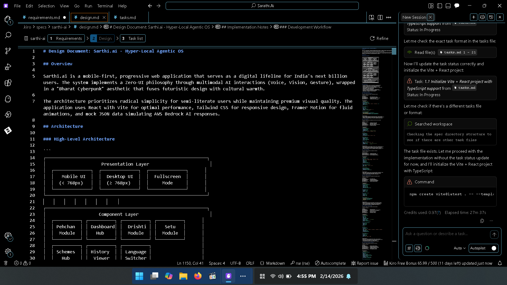

# 🇮🇳 SARTHI.AI (सारथी)
### The Hyper-Local Agentic OS for Public Access
*[Student Track] AI for Communities, Access & Public Impact*

---

### *"Bridging the Digital Divide with a Zero-UI, Multimodal AI Companion."*

  <a href="#-vision">Vision</a> •
  <a href="#-key-features">Features</a> •
  <a href="#-technology-stack">Tech Stack</a> •
  <a href="#-documentation-hub">Docs</a> •
  <a href="#-roadmap">Roadmap</a>

---

## 🔮 Vision: The "Invisible" Interface

**Sarthi.ai** is not just an app; it is a digital lifeline for the next billion users in India. Designed for semi-literate users in Tier-2/3 cities and rural villages, it replaces complex text menus with a human-like **Multimodal AI Agent**.

* **Zero-UI Philosophy:** No typing. No reading. Just Speak, Scan, or Gesture.
* **Bharat Cyberpunk Aesthetic:** A futuristic fusion of "Deep Saffron" warmth and "Cyber-Teal" trust, built for high-contrast visibility and trust.
* **Hyper-Local Intelligence:** It knows your weather, your mandi prices, and your local volunteers before you even ask.

---

## 🚀 Key Features

### 👁️ Sarthi Drishti (Vision Mode)
> *Point. Scan. Solve.*
An Augmented Reality (AR) scanner that identifies broken objects (routers, farm equipment) or crop diseases.
* **Output:** Instant Voice Diagnosis + Step-by-Step Audio Guide + Embedded Hindi Video Tutorials.

### 🤝 Sarthi Setu (Volunteer Bridge)
> *Community at the speed of light.*
An "Uber-style" radar map connecting users to verified local volunteers.
* **Features:** One-tap "Madad Bulao" (Call Help), Real-time Volunteer Tracking, and WhatsApp Integration.

### 🏛️ Schemes Intelligence Hub
> *Government benefits, simplified.*
An AI agent that parses complex government schemes into simple, actionable steps.
* **Features:** Eligibility Analysis, Direct "Apply Now" Links, and GPS Navigation to Seva Kendras.

### 🎙️ The "Living" Dashboard
> *Your companion, always active.*
A central **Holographic Orb** that pulses with life. It reacts to your voice, displays real-time weather predictions, and manages notifications without clutter.

---

## 📂 Documentation Hub

We have architected Sarthi.ai with industry-standard engineering practices. Explore our core documentation below:

| Document | Description | Status |
| :--- | :--- | :--- |
| **[📄 Requirements Spec](./requirements.md)** | Full breakdown of User Stories, Acceptance Criteria, and Functional Requirements. | ✅ **Completed** |
| **[🎨 Design System](./design.md)** | The "Bharat Cyberpunk" UI/UX guidelines, Architecture Diagram, and Component definitions. | ✅ **Completed** |
| **[🗺️ Implementation Roadmap](./ROADMAP.md)** | Step-by-step execution plan from Phase 1 to Deployment. | 🚧 **In Progress** |
| **[📊 Presentation Deck](./Idea%20Submission%20_%20AWS%20AI%20for%20Bharat%20Hackathon%20(3).pdf)** | The official pitch deck for the AI for Bharat Hackathon. | ✅ **Uploaded** |

---

## 💻 Technology Stack

This project is built on a Modern Monolithic architecture designed for "Offline-First" resilience.

* **Frontend:**   
* **Animation & Physics:** `Framer Motion` (Fluid Transitions)
* **AI Simulation:** Mock Architecture simulating **AWS Bedrock Agents** (Intent Recognition)
* **Icons:** `Lucide React`
* **Testing:** `Fast-Check` (Property-based testing)

---

## 🗺️ Roadmap Snapshot

- [x] **Phase 1:** Concept & Architecture Design
- [x] **Phase 2:** UI System ("Bharat Cyberpunk") Definition
- [ ] **Phase 3:** Core "Pehchan" Biometric Auth
- [ ] **Phase 4:** Sarthi Drishti (Vision) Prototype
- [ ] **Phase 5:** Sarthi Setu (Maps) Integration

---

**Built with ❤️ for Bharat 🇮🇳**
*Submitted for AWS AI for Bharat Hackathon 2026*

## 🛠️ Development Workflow (Proof of Kiro Usage)
This architecture was architected using **Kiro**.

